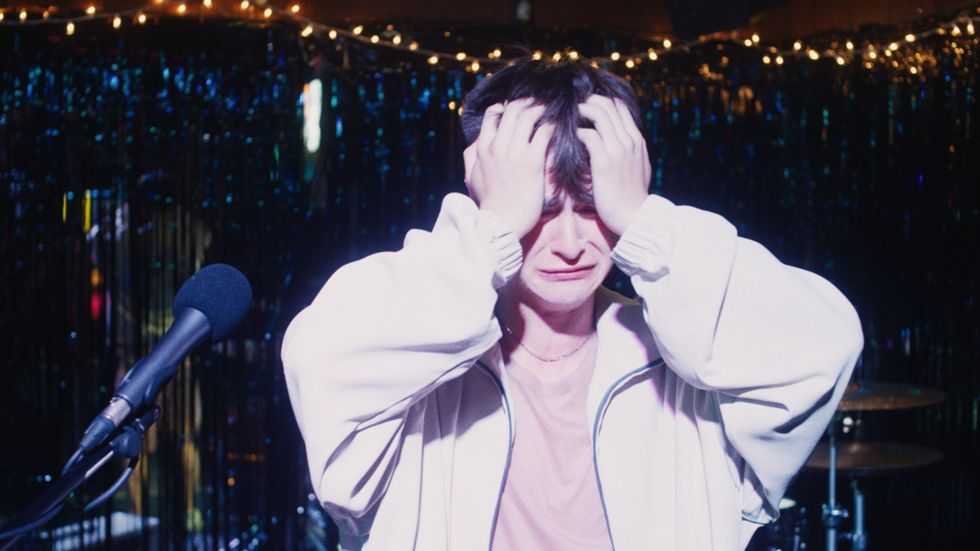
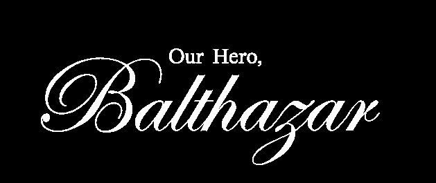
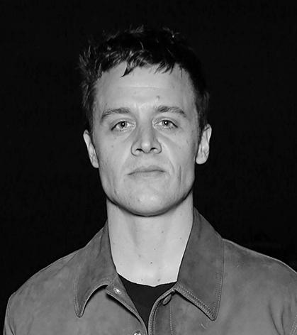

# OHB Press Notes 

## Page 1

OUR HERO, BALTHAZAR 
By Oscar Boyson

## Page 2

DIRECTOR’S STATEMENT
In the attention economy, all of life is a performance. Identity, ideology, tragedy. But how can 
we authentically process anything if it’s all a performance? And if it’s all a performance, how do 
we know what to take seriously?
With this film, my hope is to explore these questions through two lost American boys 
struggling to see the world and see each other, and in doing so to capture just how tragic and 
hilarious it is to be a young man in this decaying empire

## Page 3

LOGLINE 
Ultra-wealthy NYC teenager Balthy makes dramatic gun control videos to impress his activist crush. When an online troll targets his 
content, Balthy becomes convinced he's communicating with a potential school shooter and embarks on an ill-advised journey to 
Texas to confront him.
SYNOPSIS 
From first-time feature filmmaker Oscar Boyson comes a thoroughly audacious coming-of-age story that fearlessly explores the impact 
of social media and American gun culture on modern adolescence through an incisive yet blackly comic lens. 
Hoping to impress an activist classmate, wealthy New York City teenager Balthazar “Balthy” Malone (Jaeden Martell, It, Knives Out) 
begins posting emotional videos on social media, pleading for stricter gun laws. But his tearful clips soon attract the attention of an 
online troll who claims he is planning a school shooting. Acting on impulse, Balthy heads to Texas to try to prevent the tragedy by 
befriending the potential shooter “IRL”—a term his crush used and Balthy misunderstood.
But the misguided teen’s journey to the south takes a turn for the surreal once he meets fellow lost soul Solomon (Asa Butterfield, Sex 
Education, Hugo) IRL. Together, the two boys from vastly different worlds must navigate a confusing and combustible set of 
misunderstandings, both absurd and terrifying. Even though they find genuine moments of connection, their path nevertheless moves 
them ever closer toward an all-too-preventable fate.
A masterful marriage of dark comedy and bracing, nuanced character drama, Our Hero, Balthazar stars Jaeden Martell, Asa 
Butterfield, Chris Bauer, Jennifer Ehle, Anna Baryshnikov, Noah Centineo, Becky Ann Baker, Avan Jogia and Pippa Knowles. 
Co-written by Boyson and Ricky Camilleri, the film is also produced by Boyson and Camilleri, as well as Jon Wroblewski, David 
Duque-Estrada, Miles Skinner, Alex Hughes and Jaeden Martell.

## Page 4

OUR HERO BALTHAZAR
Our Hero, Balthazar is a darkly comedic and provocative thriller set at the volatile intersection of wealth, performance, 
trauma, and the social media age. When a privileged, emotionally stunted teenage boy from Manhattan inserts himself into 
the tragedy of a potential school shooting in Texas, what begins as a misguided attempt at online heroism spirals into 
something far more dangerous—and deeply revealing.
 
Balthazar is a teenage boy lost in the curated artifice of digital life. Desperate to be seen and to feel something real, he seizes on 
a disturbing DM exchange with a potential mass shooter as his chance to make a difference—or at least make an impact. He 
travels to Texas, convinced that he alone can prevent a tragedy, only to find himself entangled with Solomon, a volatile and 
enigmatic young man whose online persona may not match his reality.
 
Co-written and directed by Oscar Boyson (Uncut Gems, Good Time) in his feature debut, alongside co-writer Ricky Camilleri, 
the film blends unsettling tension with absurdist humor. Boyson and Camilleri explore the irony of a culture that celebrates 
personal tragedy as currency and treats empathy as performative spectacle.
 
While the first act seduces with sharp satire of elite urban aloofness, the narrative abruptly shifts—mirroring the disorienting 
way news cycles fracture reality—to the perspective of Solomon, a young man shaped by an America in which violence and 
alienation are ambient. The film refuses easy answers or moralizing. Instead, it interrogates what it means to be authentic in a 
world where every gesture might be a performance, and where tragedy has become not just a news item but a means of 
branding.
 

## Page 5

Jaeden Martell (It, Knives Out) delivers a riveting performance as Balthazar, portraying a boy both absurdly 
out of touch and heartbreakingly sincere. Asa Butterfield (Sex Education, Hugo) transforms in a role unlike 
any he’s played before, embodying a teen whose pain manifests in silence, manipulation, and menace. Their 
chemistry—carefully cultivated during weeks of rehearsal—anchors the film’s emotional core.
 
Shot on location in Texas trailer parks and backlit by the looming specter of American violence, Our Hero, 
Balthazar is less a film about a school shooting than it is a film about everything that leads to one: 
disconnection, online disinformation, class division, performative empathy, and an entire generation forced 
to navigate a world built by adults who fail to understand them.
 
Straddling satire and tragedy, Our Hero, Balthazar dares to depict teen boys in all their provocative and 
deeply human contradictions. The result is a bold, genre-defying portrait of a generation coming of age in 
the tragedy-industrial complex—desperately seeking meaning, identity, and something real in a world that 
keeps telling them how to feel.

## Page 6

INSIDE THE STORY: 
Q&A With Director/Co-Writer Producer Oscar Boyson 
& Co-Writer/Producer Ricky Camilleri

## Page 7

What were the origins of Our Hero, Balthazar?
Oscar Boyson: The mass shooting in Uvalde, Texas, that took place in May 2022 coincided with Ricky and I sitting down to write a new screenplay together. 
We’d been trying for a while to get a different project off the ground, but after running into roadblocks, we’d decided to change course and craft something new. 
We found this story about a girl from Germany who had been corresponding with the Uvalde shooter. He was the kind of kid who would go on Instagram and 
send out blind texts, trying to bait people, seeing if he could get a response by sending something extreme, a photo or a comment. On the day of the Robb 
Elementary School shooting, there was this one conversation he’d had with this German girl where he said, “I just shot my grandma.” She responded, “Cool.” 
But she didn’t know that he’d actually done it, and she didn’t know what was going to happen later that day.
Ricky Camilleri: You feel for her. This kid from across the globe, this stranger, is DMing her this weird stuff. How could she possibly know that was real? That 
felt like a microcosm of what it might be like to be a teenager in this world right now. You’re receiving a vast number of threats, be they personal or global, and 
you have to learn how to maneuver through them and know which ones to respond correctly to or not. That was where Our Hero, Balthazar was born. It came 
from us asking ourselves, What if something like this happened to a kid who actually had the means to do something about it but didn’t have the tools to respond to 
the situation correctly? That became the engine for the movie.
OB:  And to make that kid this wealthy, narcissistic boy from New York City who has a personal interest in trying to help Solomon, that was an attractive set-up. 
Ricky and I were both drawn to the comedy of these opposites, Balthazar and Solomon, being thrown together and not really understanding who the other one 
was exactly. I find the trend of people sharing personal tragedies on social media, or even taking it one step further and inserting themselves into someone else’s 
tragedy, to be fascinating, so that was an early spark too, like what could this rich boy that appears to have everything really be crying about?  
RC: As we were shaping that character, we talked about authenticity and how hard it is to feel and know what is authentic in this culture. Balthazar says, “I only 
feel real when I cry.” That idea of what is an authentic person and how you can be an authentic person, to me, feels so distorted for kids. We talked a lot about 
Kyle Rittenhouse and a moment during his trial where he cried on the stand. It seemed to be ridiculed as “crocodile tears” by a lot of liberals online. We in no 
way condone what Kyle Rittenhouse did but he was a kid, he was a product of his environment and he was on trial for his life. Why wouldn’t his tears  be 
authentic? 

## Page 8

At the same time the film is a provocative thriller and a compelling character drama, it also has a strong dose of absurdist humor running 
throughout. How did you arrive at the movie’s unconventional tone? 
RC: I look at the work of Milos Forman and something like One Flew Over the Cuckoo’s Nest, which is this beautiful, heartbreaking movie that is also 
intensely funny. We didn’t want it to be something that if it got too human, we would have to throw in a punchline to undermine that and keep the 
audience at a tonal distance. We didn’t want to make a movie that wags a finger at anybody or was paternalistic regarding some of the issues that the 
movie tackles.
Additionally, we talked about A Clockwork Orange and how the adults are absurdly broad and silly. That was something we were thinking about with 
supporting characters, bringing out how they are almost completely clueless how to interact authentically with these kids or they’re outright robbing 
them like dad and his multi level marketing supplement scheme or moms political boyfriend who cares about the issues solely for the purpose of 
soliciting donations or the Active Shooter Preparedness Training Expert - literally turning these unnecessary shootings into a revenue stream. Grifters! 
How do you feel authentic in a world of grift?
On top of that, as tragic as the story is and as tragic as life as a teenager may feel right now, this is a movie about teen boys and one of the worst mistakes 
we’ve made is denying that transgressive, puerile, teen boy humor isn’t fun and funny. 
OB: I love these characters. I love Balthazar and Solomon, and I don’t judge them. I want the audience to be right there with them, but I did not want to 
make a movie that got even near some of these subjects without being funny. People have done that. It’s a bummer. I didn’t want to do a movie about the 
aftermath of a school shooting or something terrible that happened because of the Internet. Rather, we talked about Do the Right Thing as a great movie 
that’s all about everything leading up to the moment versus the aftermath of the moment. It is a hilarious movie that is also deeply tragic. Everything is 
getting thrown into this powder keg that releases at the end, much like our film. 
RC: To us, it almost felt like a moral issue not to make another movie about a community that comes together after a mass tragedy. That almost feels like 
propaganda because these events shouldn’t be happening. Mass shootings don’t have to happen.

## Page 9

Once you settled on a premise, did you find that the writing 
process unfolded rather quickly?  
OB: It was kinda fits and starts, because the actors and collaborators we shared it with 
were so encouraging and that would inspire us, but all the people we were hoping 
would invest in the movie were not so encouraging. With a story like this, it’s so third 
rail for most people. Everybody passed on it, and the more people passed, the more I 
was like, OK, we have to make this. If we make it, there will be nothing else like it, and 
that gives me confidence that there will be a market and an audience for it because we 
won’t be competing with anything else. Because this is a totally independent film, it 
allowed us to stay true to our original vision.
Oscar, you’re a longtime veteran of the indie film world, 
having produced films including Uncut Gems, Good Time 
and Frances Ha, among many others. Why was now the 
right time to make your feature directorial debut? Had you 
always planned to direct?
OB: That was always the plan. It just took a little longer than I intended. I 
moved to New York in 2007, and I was very lucky to fall in with a community 
of filmmakers who inspired me, peers I wanted to impress and work with. 
Given how successful some of those people were, it was hard for me to 
prioritize myself and my own work. You want to work on the next movie, and 
the next one after that. I had my commercial projects and music videos, and I 
would make a short film every few years. Our Hero, Balthazar was the first 
time I said no to everyone but myself.
With this film, it did feel like such a small story to me when we started on it. 
Having worked on stuff like Frances Ha or Heaven Knows What—where 
everybody on those movies was in, like, one van—it was incredibly 
empowering, because you know that you can make something good with less. 
I just had a confidence that we could keep this small yet make a small story feel 
big if we did it well. It started to snowball, though, and we were able to make 
it a lot bigger than I imagined it when we started writing.
What role did casting Jaeden Martell and Asa Butterfield play in 
expanding that sense of scale? What qualities did they bring to their 
respective characters?
OB: Jaeden was first. We both had our eyes on him for a while. As a child actor, he’s worked on 
extremely professional, big budget productions, and he was really excited to get kind of gritty and 
to be extremely collaborative and a part of the process on a relatively lower-budget movie. Jaeden 
read the script multiple times. He had a very deep understanding of the character. He’s a deep 
reader. He’s a contemplative thinker. I trusted that he was going to bring us what we needed. 
That was really borne out in December 2023—we had a false start where we thought we were 
going to start production, but when that didn’t happen, I was like, Let’s go out and make a short 
film. We did a couple days of Jaeden trying out this Balthazar character. We didn’t do the haircut 
yet, but we had some wardrobe ideas. We had him walk around New York. We made some of his 
cry videos. To me, that was a great exercise. It was evidence that Jaeden was really prioritizing this 
movie, and it was evidence that this movie was going to work. 

## Page 10

What about Asa as Solomon?
OB: We started talking September of 2023. He started working with a coach on the Texas accent. Again, he was incredibly inquisitive, super perceptive, super interested in getting this character 
right. We traded a lot of videos of real people, Internet personalities, shit posters and trolls, asocial types that screamed loud on the Internet even if you could tell they were going through stuff in 
their private and personal lives. Certainly, Asa’s never played a character like this before, but he really did his homework and showed up with a tremendous passion to improve upon what he’d 
done.
My favorite part of making this film was the two weeks that we were rehearsing mostly with Jaeden and Asa before we started shooting in Texas in May of 2024. It just gave me tremendous faith 
and excitement that we’d chosen these two brilliant young actors. They were really getting along, and they were showing me stuff that I never expected. 
Balthy arrives in Texas as the walking embodiment of how Blue Staters perceive Red Staters. What preconceptions of our national divide did you 
specifically want to challenge with the film? 
OB: Well, we shot on location in Arlington, Texas, with a little bit of Fort Worth and Denton, Texas. With Solomon, it was important to us that he lived somewhere that looks like most of America. 
He lives in a trailer park, but not the quintessential rural farmhouse location that we’ve seen in so many movies that evokes a country song or something. I wanted to have a trailer park that felt like a 
community - which it was, and so many of the actual residents appeared in film and made it a warm place to go to work every day. But also a place where you can see the city lights at night and you 
can see the highway. They’re not out in the middle of nowhere. That was one way we thought of challenging preconceived notions, but obviously the Solomon character is the big one. 
RC: In earlier drafts Solomon really lived up to Balthy’s preconceptions but we kept running into walls with that. Eventually we came across this idea that what if Solomon wasn’t what he told 
Balthy he was and what if that changed how Balthy felt about the whole mission? Instead of softening Balthazar, Solomon’s emotional vulnerability hardens and exacerbates Balthazar’s developing 
thirst for violence.
Talk about the time jump in the movie. Most movies would cross cut, but you chose to begin the second act of the movie with the first act of 
another character. What was the intention behind this?
OB: Some ideas come up and it takes an hour or a day before you leave it and move on, but with this as soon as we started talking about it, it was hard to see the movie any other way. We look 
for ways to surprise the audience, or let them think the movie is one thing before revealing that its actually something else, and the choice certainly delivered in that respect. But just in terms of 
character, I think about my favorite novels and so many of them will go 30 or 40 pages with one character before switching to a new chapter and another character. I’ve always liked that feeling 
of switching perspectives at the exact moment your “what’s gonna happen next” factor peaks, and this movie gave us the chance to do that. 
RC: We tried several drafts with a cross cut and it just never felt right to us. It made Balthy feel less human and it made the reveal of Solomon less fun. We’ve sort of reached a point with movies 
where, during the process, a lot of people think a movie has to be one way, but those same people are excited when a movie pulls off a structural curve ball. So, against a number of other people's 
judgements, we went for it. I want to be surprised by where a movie goes, not watching and waiting to get to the expected genre beats or have the morality of the filmmakers explained to me 
through the characters. 

## Page 11

Social media supposedly encourages and rewards authenticity, but 
your film demonstrates how performance is an inherent part of any 
would-be influencers' toolkit. Can anyone truly be their "authentic 
selves" online or are we all putting on a performance like Balthy?
OB:  Social media started around the time I was Balthazar’s age, so I can remember that 
period when it felt exciting and more like the wild west and there wasn’t a “right way” to go 
about using it. Our parents weren’t using it and it wasn’t so saturated with ads. I had 90K or 
so followers when I was using it a lot, and what stuck with me the most from that time was 
how these teenage boys who were trying to figure out how to get more followers would 
message me and send me their videos which were largely imitations of popular male 
influencers and ask me what they were doing wrong. I felt terrible for these kids, because that’s 
such a different entry point and experience compared to what we had in the early 2000s, when 
there wasn’t anything to copy. And I think that difference is a key part to my answer, which is 
that yes, you can be authentic, but social media doesn’t reward it. As a system, it’s designed to 
reward the dopamine hit, the like button, and the most efficient way to get there is almost 
always going to be a performance.  
RC:I think, at this point, social media has just exacerbated the conscious and subconscious 
feelings created by advertising, marketing and political spin. It feels like it has rendered nearly 
all happenings, beyond the immediately personal, inauthentic. We are so immediately 
inundated by response and commentary that our own personal reactions to mass tragedy 
quickly become a response to the response to the response. I hate social media. I hate the 
monetization of making our lives and feelings public. I like to think most people feel this way 
but they’ve also been made to feel they can’t live without it. Like so many elements of our lives 
we feel completely powerless to change something we’d prefer not exist. 
 
Naomi Klein popularized the concept of the "tragedy industrial 
complex" in reference to how corporations profit from natural 
disasters and other calamities. But there's a version that plays out 
online as individuals like Balthy compete to offer the most 
extreme or hyperbolic reactions to tragedy in their search for 
likes and subscribers. How does that change the way that society 
processes tragedies like mass shootings now and in the future?
OB: Observing a tragedy and being sad about it is one thing but being the victim is 
almost a sure-fire way to forge a successful identity online. Of course with Balthazar you 
could say he’s taking it one step further. The threat of school shootings are so built into 
what it means to be a teenager today that he can insert himself into the fictional tragedy 
that happens early in the film and make that part of his online identity. But whether 
you are taking to social media to cry, or share your anger, or co-opting someone else’s 
tragedy for likes - none of these responses do anything for whoever is actually suffering, 
and that’s probably the most maddening part. You think you’re processing a tragedy, 
but you’re really just depressed that not enough people liked your post. So now you’ve 
built an identity around caring for something you don’t actually care about, which 
fosters the same kind of cognitive dissonance that Balthy ends up displaying 
throughout much of the film.       
RC: It makes them a brand, like a corporation and like a corporation they  have to 
think about how their  feelings look  to other people, how they’re  showing empathy vs 
being and feeling empathetic. I think for Balthy, he’s already surrounded by people who 
can profit off the most tragic thing that could happen to him and his peers, so how does 
that contribute to or foster a kind of sociopathy? Maybe Balthy would be able to 
process how he actually feels about violence (arousal and stimulation) if he wasn’t 
already inundated with how he’s supposed to feel. 

## Page 12

What makes this movie different from the flock of rich people satire that we’ve seen post-Succession?” 
OB: There’s a language that’s been developed with wealth satire and we wanted the first act of the movie to get the audience laughing and get them comfortable thinking they 
were in for that kind of ride. But then we go to Texas and meet this new character who is about as far from Balthazar’s wealth as you can imagine, and the movie dares you to 
keep laughing. Ricky and I talk about how lower or middle class satire hits so much harder than the stuff that pokes fun exclusively at the wealthy. So we focused a lot on that 
moment when hopefully the audience recognizes they’re in for something deeper than a surface level class satire. 
RC: I think the last thing we wanted to do was make fun of the wealthy while also bathing in their luxury. Wealth satire is one of the most toothless forms of satire there is and 
you know this because wealthy people love it more than non wealthy people. So we talked a lot about how to portray Balthy’s world without it feeling seductive or like 
something rich people themselves  would get off on. 
Were there specific movies you were thinking about while writing and shooting?
OB: Bully is a movie we talk about a lot, where you know something bad is going to happen as these kids get way over their heads and talk themselves into doing something really 
horrible, but you can’t look away. Same thing with Todd Solondz’s characters and his non-judgemental comedy, especially in Welcome to the Dollhouse or Palindromes. 
RC: There’s obvious influences like Taxi Driver, specifically how funny Taxi Driver can be, Pusher 2 was something I saw for the first time just before shooting which we felt like 
it mirrored Solomon’s arc a bit. We talked a lot about the look of Lukas Moodyson’s Fucking Amal, Von Trier’s Breaking the Waves and The Idiots. We talked about Muriel’s 
Wedding. 
Is there hope for Balthy at the end of the film? Or has he forever been lost to his Instagram reel screen?
OB: I don’t think Balthazar is lost to an instagram reel. I think he’s lost to the narrativizing that media; from CNN and ABC to Instagram and TikTok naturally do. He 
decided what his narrative, his identity was going to be because that’s how teenagers are incentivized to define themselves now. They’re a fully developed brand before their 
brain is fully developed. For Balthy, he’s not lost to a screen anymore, he’s lost to the brand he’s built for himself. 
RC: I agree. 

## Page 13

DISCOVERING BALTHAZAR: 
Q&A With Actor Jaeden Martell

## Page 14

This role requires you to navigate some complex, challenging subject matter. What gave you the confidence you could pull it off?
JM: There is always an inner-struggle of whether I’m worthy or not to take on a role.. one of the only things that gave me confidence was trust from those I trust, the talented cast and crew that I 
know are giving their all. The days I felt something closest to confidence were the days I went home completely exhausted. 
What did you find most rewarding, or most challenging, about playing Balthazar?
JM: In most movies, certainly movies I’ve done, things are happening TO the protagonist. With this film, Balthy seems to be happening to the movie and to the world around him. There’s 
something rewarding about playing someone who propels the story, who is so out of control that he is in control. But there is a sort of whiplash, nauseating effect of playing someone so confused 
about their identity. And especially when it starts to apply itself to real life relationships. Even myself coming on set.. I’m coming to a new place and I want to be best friends with everyone there. 
And not that I didn’t get along with everyone, but it could not occupy space in my mind as it usually would.. I had to distrust everyone and imagine that everyone hated me, while still 
maintaining the innate and boyish thing of wanting them to like me. Even around people, I felt and had to feel utterly alone. 
You're well-known for roles you played as a child, from Midnight Special to St. Vincent, to It. Did you feel the role of Balthazar was subverting 
what audiences might expect from you?
JM: It isn’t necessary for me to consider the audience, but Balthazar certainly subverted what I knew myself to be capable of. Especially because Balthy, despite his darkness, is quite a juvenile 
character so the comfort of doing what I’ve done before was always tugging at me, the low-bearing fruit always in reach. I knew I was doing the right thing when I turned the other way. 
Balthazar’s motivations are seemingly unclear to even himself at times. Was it difficult to know how to play scenes when dealing with a 
character who is a mystery even to himself?
JM: That essentially sums up my entire internal experience playing this character. The question of whether I was the hero or the villain always nagged at me. Preparation is understanding but it 
unfortunately and painfully is not as easy as defining, because people are complex. We all have ideas of ourselves, but they’re often wrong. There eventually came a release and peace with knowing 
that I did not know. And embracing B’s righteous opinion of himself. Thinking of him as flawed or as the villain was me, the actor, being pulled out far enough to see the big picture, which is 
not my duty. 

## Page 15

PLAYING ALL OF SOLOMON: 
Q&A With Actor Asa Butterfield

## Page 16

You're well-known for roles you played as a child or teenage actor, from Hugo up to Sex Education. Did you feel the role of Solomon was 
subverting what audiences knew you for?
AB: Absolutely, it’s one of the reasons I really wanted to do this film. He’s a man of extremes, real highs and crashing lows, that expressiveness and unpredictability was something I haven’t had a 
lot of chance to explore, which was really exciting. Combining that with the accent, his physicality, it helped me create a really clear image in my head of who he was, and how he navigated the 
world. 
Given that this role represents such a huge departure for you, were you confident from the outset of the project that you could pull it off?
AB: I wouldn’t say confidence as much as it was a trust in the team around me, the writing, and my own desire to really push myself in a new direction. Some of the best films are those that 
question our world view, that confront the ugly side of prejudice and society, it was exciting to be a part of something like that.
Could you elaborate on what drew you to this character and made you want to take on this project?
AB: I think it was the challenge of creating a character as flawed and abrasive as he is, while still making us feel for him. Seeing his desperation, his need for love, underneath his spikey and 
confrontational exterior. Working with Oscar to find that balance and really choose the moments we peek behind the curtain was a lot of fun.
What was the most difficult part about playing Solomon?
AB: Honestly, the hardest part was also probably the most rewarding. As I said before, finding that balance, letting myself access the pain and rage inside this young man, it’s not something I’ve 
had to do in many of my roles before. I’m not a particularly confrontational person, and I don’t get angry easily, so tapping into that was a real reflective challenge.
The audience assumes Solomon is one thing, but he turns out to be something very different. Yet we then watch him try to assume this identity 
that has brought Balthy to him. How did you approach walking that tightrope in your performance?
AB: It’s something Oscar, Ricky and I constantly spoke about. What is this mask he puts on, when do we see through the cracks, and when does it slip. Solomon is a victim of circumstance, so 
how do we play on the audiences assumptions about him, and the people in his world. It’s one of the core themes of the story, and something that feels particularly relevant today. 

## Page 17

KEY CONTRIBUTORS
Oscar Boyson – DIRECTOR, CO-WRITER, PRODUCER
Oscar Boyson was born and raised in Maine and lives and works in New York City. His producing work includes 
Frances Ha and Mistress America for Noah Baumbach, Heaven Knows What, Good Time, and Uncut Gems for 
Josh & Benny Safdie, and the original HBO series Chillin Island for HBO. Boyson's directorial credits include 
the short film Power Signal (2023) which premiered at the Sundance Film Festival in 2023, and dozens of music 
videos, commercials and short films.
Ricky Camilleri – CO-WRITER, PRODUCER
Ricky Camilleri is a writer and producer with over 15 years of experience in film, television, and digital media. He 
studied film, writing, and media theory at Hampshire College in Amherst, Massachusetts, and began his career in 
New York’s independent media scene. He was a founding host and producer of HuffPost Live, helping launch 
one of the first live-streaming news platforms, and later created and hosted Build, a daily live interview series that 
featured hundreds of conversations with major figures in film, television, music, and publishing. Alongside his 
on-camera work, Ricky has consistently developed original narrative content—writing and producing shorts, 
branded films, and multiple feature scripts, several of which have been purchased and developed by established 
production companies.

## Page 18

CAST
Immensely talented and dynamic on screen, Jaeden Martell has already amassed quite a résumé at a young 
age, acting with an extraordinary list of actors and directors.
Most recently, Jaeden stars in Arcadian, the post apocalyptical thriller opposite Nicolas Cage in Ireland and 
Y2K directed by Kyle Mooney, starring opposite Rachel Zegler.
Jaeden also stars in Netflix/Blumhouse’s thriller Mr. Harrigan’s Phone, directed by John Lee Hancock and 
also starring Donald Sutherland, reuniting with writer Stephen King.
In 2021, Jaeden starred in Netflix’s Metal Lords, directed by Peter Sollett and written and produced by D.B. 
Weiss, creator of Game of Thrones.
He can also be seen in the limited series Defending Jacob on Apple TV+, based on the bestselling 
crime-drama by William Landay. He portrays the enigmatic titular character as a teenager accused of 
murder, alongside onscreen parents Chris Evans and Michelle Dockery
In 2019, Jaeden reprised his role in the losers’ club in IT Chapter 2, the much anticipated follow-up to IT. 
He also took part in Rian Johnson’s star-studded murder mystery Knives Out as a member of the 
dysfunctional Thrombey family. Premiering at Sundance Film festival, Jaeden appeared in psychological 
thriller, The Lodge which was acquired by Neon and opened to frightened acclaim. He could also be seen in 
the A24 indie drama Lowtide which premiered at Tribeca Film Festival, following four teenage boys through 
friendship and betrayal in a small New Jersey beach town. 
Jaeden Martell as BALTHAZAR.
In one of his biggest films to date, Jaeden starred as the fearless leader of the Losers’ club in the record-breaking remake of horror classic IT as Bill Denborough. The Warner Brothers 
film follows a group of kids as they try to fight off the evil clown known as Pennywise. And earlier in 2017, Martell played the titular character in Focus Feature’s The Book of Henry as a 
child genius, reuniting with Naomi Watts. Alongside Clive Owen, Jaeden shines in the father-son misadventure The Confirmation released in 2016.
Premiering at the prestigious Berlin Film Festival, Midnight Special featured Martell as a boy with special powers on the run with his father, Michael Shannon. Also starring Joel 
Edgerton and Kirsten Dunst, the gritty sci-fi film was written and directed by Jeff Nichols. Earlier that year he was also lucky enough to work with famed director Cameron Crowe in 
Sony’s Aloha with Rachel McAdams, Bradley Cooper, and Emma Stone.  
Also, Jaeden had a recurring role in the last two seasons of the award-winning Showtime series Masters of Sex as the son of Dr. William Masters played by Michael Sheen.

## Page 19

CAST
British actor Asa Butterfield is arguably best known for his role as Otis Milburn, 
in the Netflix worldwide phenomenon Sex Education. He will next star in Out of 
the Dust for Netflix, a six-part psychological thriller. Asa made his stage debut in 
January, in his one man play, Second Best at Riverside Studios. 
Asa made his on-screen debut at the age of eight in After Thomas (2006). In 2007, 
he featured in Son of Rainbow alongside Will Poulter. The following year Asa 
starred in the film adaptation of John Bayne’s novel by the same name, The Boy in 
the Striped Pajamas. A leading role that earned him critical acclaim and a 
nomination for a British Independent Film Award for Most Promising 
Newcomer. In 2011, he starred in Martin Scorsese’s adventure film Hugo and in 
2015 in James Graham’s, A Brilliant Young Mind. 
Asa led in the festive film, Your Christmas or Mine for Amazon Prime, released at 
the end of 2022. A sequel followed in 2023, titled Your Christmas or Mine 2. 
Asa’s further film and TV credits also include: Choose Or Die (2022), Greed 
(2019), Watch The Skies (2019), Slaughterhouse Rulez (2018), Time Freak (2018), 
Then Came You (2018), Wrong Place Right Tim (Short) (2018), Thunderbirds 
Are Go (2017), The House Of Tomorrow (2017), Journey’s End (2017), The Space 
Between Us (2017), Miss Peregrine's Home For Peculiar Children (2016), 10,000 
Saints (2015), Ender’s Game (2013), The Wolfman (2010), Nanny Mcphee 
Returns (2010), Merlin (2008) And Ashes To Ashes (2008). 
Asa Butterfield (Martin Scorsese's Hugo, 
Netflix's Sex Education) as SOLOMON.

## Page 20

CAST / EXECUTIVE PRODUCER 
Noah Centineo  continues to expand his talents as an actor and producer. 
  
Centineo can be seen starring in the Netflix series The Recruit, in which he also serves as an executive producer. Season 1 of the dramatic thriller followed 
Centineo and co-starred Daniel Quincy Annoh and Laura Haddock as they navigated the world of international espionage. The series returned for a second 
season on January 30 2025 with Centineo starring alongside Teo Yoo. 
 
This April, Centineo was seen in A24’s Warfare from Ray Mendoza and Alex Garland. The film stars D’Pharoah Woon-A-Tai, Charles Melton, Joseph Quinn, 
Kit Connor, Will Poulter, among others. 
 
Up next, Centineo will be seen in Oscar Boyson’s directorial debut Our Hero, Balthazar,, in which he also serves as a producer through his Arkhum banner. The 
film will premiere at the Tribeca Film Festival in June. 
  
2023 marked the launch of Centineo’s production company, ARKHUM PRODUCTIONS. Alongside Head of Production, Enzo Marc, Arkhum will focus on 
comedy and drama projects with an emphasis on social commentary. It was announced that Arkhum will be producing the short film META, with Centineo cast 
to star alongside Ivanna Sakhno at Prime Render Studios. Centineo is also set to star in LISTEN, a co-production between Arkhum, Bound Entertainment and 
Will Smith’s WESTBROOK. 
  
Centineo made a cameo in Dream Scenario  which made its debut at the 2023 Toronto International Film Festival on September 8. The A24 film, which stars 
Nicolas Cage, premiered to rave reviews and was a favorite out of the festival.  
  
In 2022, Centineo was seen starring as ‘Atom Smasher’ in DC’s Black Adam  alongside Dwayne Johnson, Aldis Hodge, Pierce Brosnan and Quintessa 
Swindell. The film was released by Warner Bros on October 21, 2022.  
  
Centineo rose to fame in the wildly popular Netflix trilogy To All the Boys I’ve Loved Before. For his role as ‘Peter Kavinsky’ in the film adaptation of Jenny Han’s 
best-selling novel, he won an MTV Movie Award for Best Breakthrough Performance. He reprised his role in the sequel TATB: P.S. I Still Love You  and most 
recently, returned for the third and final film of the series which was released on February 12, 2021. Earlier this year, Centineo reprised his role as Peter Kavinsky in 
the second season of Netflix’s spinoff series XO, Kitty. 
   
In 2019, Centineo was seen in the Elizabeth Banks directed Charlie's Angels opposite Kristen Stewart, Naomi Scott and Ella Balinska and starred in Netflix’s The 
Perfect Date opposite Laura Marano. That year, he also made his directorial debut and starred in ARTY’s “Save Me Tonight” music video alongside Lily Collins.  
   
In 2018, Centineo starred opposite Shannon Purser and Kristine Froseth in Ian Samuel’s Sierra Burgess is a Loser , a contemporary retelling of the classic Cyrano 
de Bergerac story.  
   
He first came to prominence for his work in the ABC Family / Freeform series The Fosters, for which he was nominated for a 2017 Teen Choice Award. He later 
reprised his role as a guest star in the spin off Good Trouble. 
 
Noah Centineo as ANTONY, 
Balthazar's life coach.

## Page 21

CAST
Jennifer Ehle is two-time Tony Award and BAFTA winning actress. She will soon film 
the AMC series Interview with a Vampire. She can be seen in the Paramount+ series 
Lioness. She starred in Alice Birch’s Amazon series, Dead Ringers, based on David 
Cronenberg’s cult classic from the 1980s. She also starred in Maria Schrader's film, She 
Said, as well as Taylor Sheridan’s Paramount+ series, 1923. She previously starred in Rose 
Glass' horror feature, Saint Maud, for which she was nominated for a British 
Independent Film Award for Best Supporting Actress. She also starred in John and the 
Hole, directed by Pascual Sisto which premiered at Sundance. She also starred opposite 
Jeff Daniels in the Showtime mini-series, The Comey Rule, written and directed by Billy 
Ray. She can recently be seen in this season's Law and Order: Organized Crime. 
Ehle’s other notable film credits include: Tom Hooper’s multi-Academy Award-winning 
The King’s Speech, Kathryn Bigelow’s Detroit and Zero Dark Thirty, Steven Soderbergh’s 
Contagion, George Clooney’s The Ides of March, Neil LaBute’s Possession, István Szabó’s 
Sunshine; and Sam Taylor-Johnson’s Fifty Shades franchise.
Jennifer Ehle (Pride and Prejudice, The King’s 
Speech, She Said) as Balthazar's mother, 
NICOLE.

## Page 22

CAST
Becky Ann Baker may be most recognized for her mothering skills, or lack 
thereof, in two Judd Apatow series, Freaks and Geeks and Girls (earning 
Emmy and Critics’ Choice nominations in the latter as mom to Lena 
Dunham’s ‘Hannah’).
 She appeared in Ted Lasso (for which she earned her second Emmy 
nomination), Billions, New Amsterdam, and Big Little Lies. Other television 
credits include Brockmire, The Good Fight, Gotham, Younger and an 
upcoming episode of Only Murders in the Building. 
On film, she’s appeared in Ridley Scott’s White Squall, Barry Sonnenfeld’s 
Men in Black, Sam Raimi’s A Simple Plan, Steven Spielberg’s War of the 
Worlds, All Happy Families and most recently, Jim Brooks’ Ella McCay. 
Also an acclaimed theater actress, Becky was a member of the original 
companies of The Best Little Whorehouse in Texas, Titanic, and Stephen 
Sondheim’s Assassins. Other productions include All My Sons and A 
Streetcar Named Desire. Other credits include David Lindsay-Abaire’s Good 
People with Frances McDormand and the acclaimed production of The 
Hairy Ape at the Park Avenue Armory. 
Becky Ann Baker (Men in Black, Spider 
Man, Ted Lasso, Billions) as Solomon's 
grandmother.

## Page 23

CAST
Chris Bauer has appeared in over 300 episodes of television, 40 feature films, and 
several theater productions on Broadway and Off. His multiple long running 
television credits include Frank Sobotka in The Wire, Andy Bellefleur'in True 
Blood, and Bobby Dwyer in The Deuce for HBO. 
Chris will next be seen in the Paramount+ limited series, JonBenet, the Peacock hit 
series, Poker Face, and the Netflix series, His & Hers. He starred as pro wrestler 
Wild Bill Hancock on Heels for Starz, where he also appeared in Gaslit with Julia 
Roberts and Sean Penn, and Survivor's Remorse, produced by LeBron James, and 
played Joe McCarthy in the Peabody Award winning Fellow Travelers for 
Showtime. On Apple TV, he played Deke Slayton in the inaugural season of For 
All Mankind, and appeared as Det. Tom Lange in People Vs. OJ for FX. 
Recent feature credits include co-starring with Denzel Washington in the Warner 
Brothers film The Little Things, 20th Century's Eenie Meanie, The Razor's Edge, 
Money Monster, and Sully. He received an Outer Critic’s nomination for playing 
Mitch in A Streetcar Named Desire on Broadway, and has original roles in plays by 
Jez Butterworth, John Patrick Shanley, and David Mamet, whose play is the 
source material for Chris' appearance in the upcoming film, Henry Johnson. 
He is a graduate of the Yale School of Drama and a metalhead.
Chris Bauer (The Wire, True Blood, The Deuce) 
as Solomon's father, BEAVER. 

## Page 24

CAST
Pippa Knowles is a young up-and-coming actress based in New York City. She has been 
training in acting, singing, and dancing at various studios in the tri-state area since she was 
13 years old, including Actors Technique NY, Patrick Page Acting Studio, The Barrow 
Group, Paper Mill Playhouse, AC Dance, Sharron Miller’s Academy for the Performing 
Arts, and Voice Soaring Studios. 
 In just 3 years, Pippa has performed at several prestigious theaters, including at the A.R.T 
Theatre, the Vineyard Theatre, the John Cullum Theatre, and on Paper Mill Playhouse’s 
mainstage. Some performance highlights include: Billie Bendix (Nice Work If You Can Get 
It), Elle Woods (Legally Blonde), Reno Sweeney (Anything Goes),  Janis Sarkisian (Mean 
Girls), Ladybug (James and the Giant Peach), Sharpay Evans (High School Musical).
Pippa signed with Nouveaux Talent Management in 2021, and JGD Talent Agency in 
2022. She booked her first co-star role in 2023 on the HBO Max series And Just Like That, 
and shortly after booked her first national commercial. She kept up her training through 
work in short films and senior thesis films, her two favorites being Noah in You First 
(Wesleyan University) and Olivia in Traces (The New School). In 2024, she was cast in her 
very first SAG feature film as Eleanor, the primary female lead in Our Hero, Balthazar, and 
got to truly discover just how much she adores film. 
Pippa Knowles as Eleanor.

## Page 25

CAST
Avan Jogia most recently completed filming on the Amazon MGM Studios series 56 Days, based on the 
international best-selling novel by Catherine Ryan Howard, starring opposite Dove Cameron and 
produced by James Wan.
 He also recently completed filming on the independent feature Our Hero, Balthazar, written and directed 
by Oscar Boyson and starring Jennifer Ehle, Noah Centineo and Asa Butterfield, which will premiere at 
the 2026 Tribeca Film Festival. Avan’s second book of poetry, titled Autopsy (Of an Ex-Teen Heartthrob) 
was recently published by Gallery Books in February 2025 and has become a National Bestseller.  
Avan’s feature acting credits include Choose Love for Netflix, their first interactive rom-com; Sony’s latest 
Resident Evil reboot;  Zombieland 2 opposite Emma Stone, Bill Murray, and Woody Harrelson for 
director Ruben Fleischer and Sony; Shaft for New Line; The Exchange for director Dan Mazer; The 
Artist’s Wife opposite Lena Olin; The New Romantic which premiered at SXSW in 2018; Paper Year 
opposite Eve Hewson; A Midsummer Night’s Dream alongside Lily Rabe, Finn Wittrock, Hamish 
Linklater and Fran Kranz; I am Michael which premiered at the 2015 Sundance Film Festival; and Ten 
Thousand Saints which also premiered at the Sundance Film Festival in 2015.  
Avan’s television credits include the AMC spinoff series Orphan Black: Echoes opposite Krysten Ritter; the 
Starz series Now Apocalypse created by Gregg Araki; The Strangersfor Quibi, written and directed by Veena 
Sud; and Tut as King Tutankhamun opposite Sir Ben Kingsley for Spike TV. 
Avan made his feature writing/directing debut with Door Mouse, starring Hayley Law, Keith Powers, and 
Famke Janssen. In 2019, Avan published his first book titled Mixed Feelings: Poems and Stories, in which 
he explores emotions around race, identity, religion and family.
Avan Jogia (Tut, Zombieland, Shaft) as 
Beaver's business partner, SUPES.

## Page 26

CAST
Anna Baryshnikov was most recently seen in a critically 
acclaimed performance in Rose Glass's Love Lies Bleeding 
opposite Kristen Stewart. Previous films include Kenneth 
Lonergan’s Manchester by the Sea, and Sara Colangelo’s The 
Kindergarten Teacher. 
Anna played Lavinia Dickinson on Apple TV+’s Dickinson for 
three seasons, as well as appearing in numerous other tv shows 
such as Doll and Em, Superior Donuts, Prodigal Son and Good 
Girls Revolt. 
She’s appeared on and off Broadway in plays such as Time and 
the Conways, ChekhovOS, and Samuel Hunter’s A Bright New 
Boise. 
She'll next be seen in Idiotka in which she stars alongside Julia 
Fox and Camila Mendes, Sender produced by Jamie Lee Curtis, 
and opposite Robert Pattinson in Kristoffer Borgli’s The 
Drama for A24. 
She is currently shooting Cape Fear for Apple TV+ opposite 
Javier Bardem and Amy Adams. She attended Northwestern 
University.
Anna Baryshnikov (Love Lies 
Bleeding, Manchester by the Sea) as 
Solomon's coworker, TAYLOR.

## Page 27

CREW
Written by Ricky Camilleri & Oscar Boyson
Produced by: Oscar Boyson, Ricky Camilleri, Jon Wroblewski, David Duque-Estrada, Alex Hughes, Jaeden Martell, Miles Skinner
Director of Photography: Christopher Messina
Production Designer: Stephen Phelps
Costume Designer: Emily Costantino
Edited by: Nate DeYoung & Erin DeWitt
Original Score Composed by: James William Blades
Supervising Sound Editor: Joseph Winterbotham
Executive Producers: Noah Centineo, Enzo Marc, Halsey, Anthony Li, Scott Aharoni, Sinan Eczacibasi, Alihan Yalcindag, Riccardo Maddalosso, Eugene 
Kotlyarenko, Alex Black, Nathan Wing, Grace Zander, Del Eswar, DJ Jiang, Nicholas Erickson, Anna-nora Berstein, Zak Williams, Christian Sosa, Peter Gold, 
Blaine Kern III, Pir Granoff.
PRODUCTION
Oh Boy Productions
Spacemaker
Curious Gremlin
Arkhum
Bureau Unknown
Giant Leap
CAST
Jaeden Martell, Asa Butterfield, Noah Centineo, Jennifer Ehle, Becky Ann Baker, Chris 
Bauer, Pippa Knowles, Avan Jogia, Anna Baryshnikov

## Page 28

WORLDWIDE SALES
Visit Films
718.312.8210
info@visitfilms.com 
US PRESS
Alexa Tombs
alexa@cineticmedia.com
973-908-7243
Charlie Olsky
charlie@cineticmedia.com 
917 545-7260

## Page 29

FACTS
Shooting format: Digital
Aspect ratio: 2.39:1
Film length: 91 minutes
Language: English with English Subtitles.

